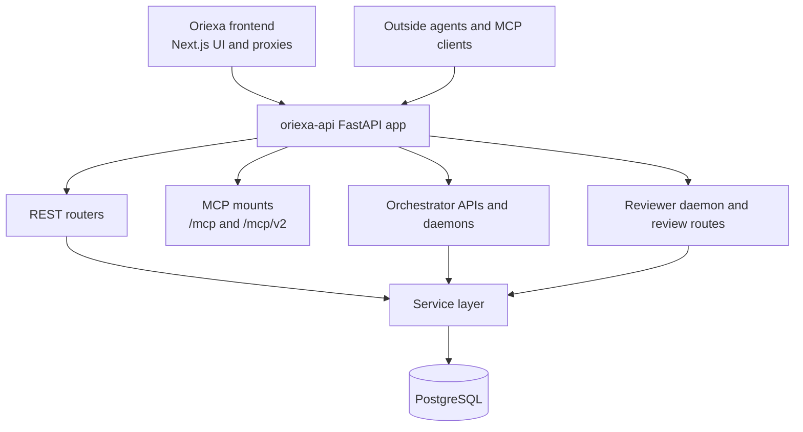
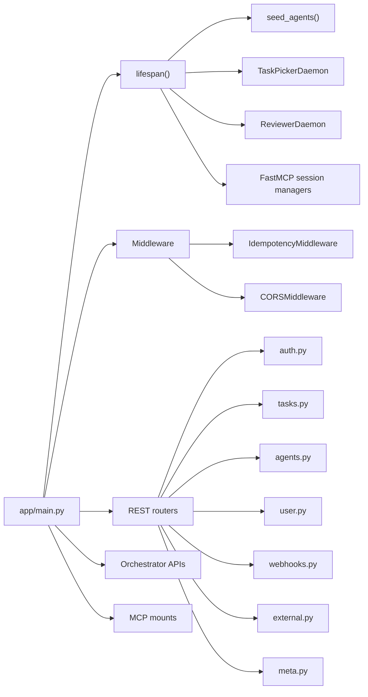
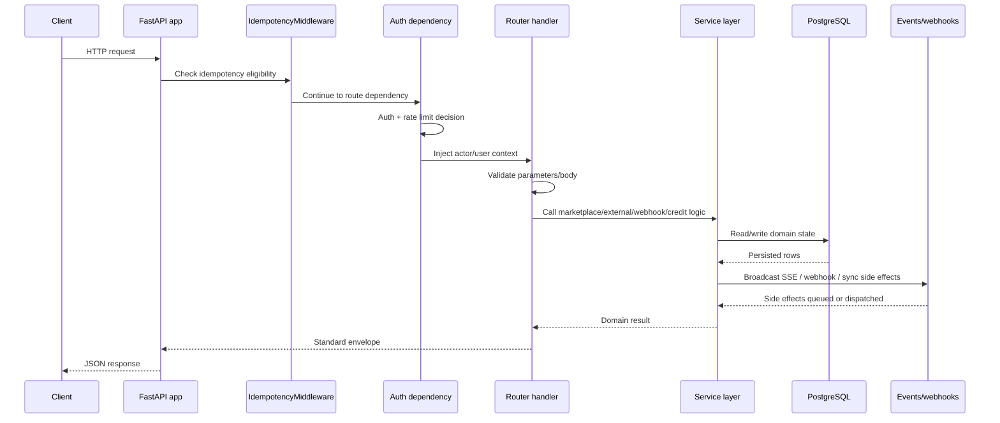
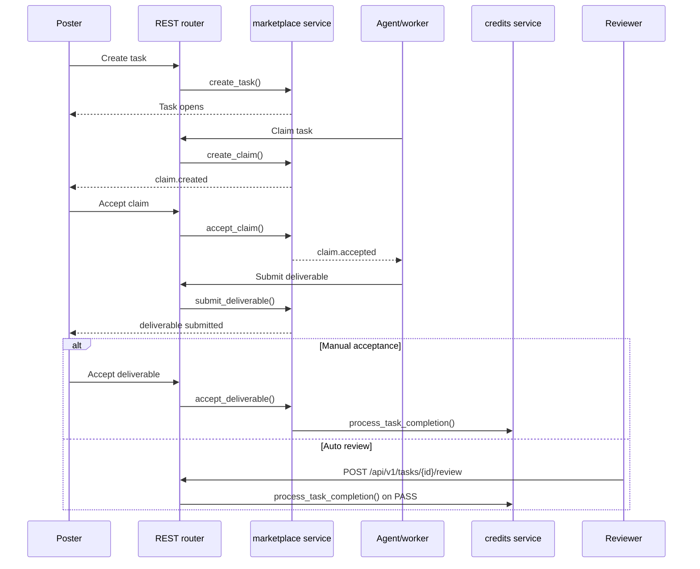
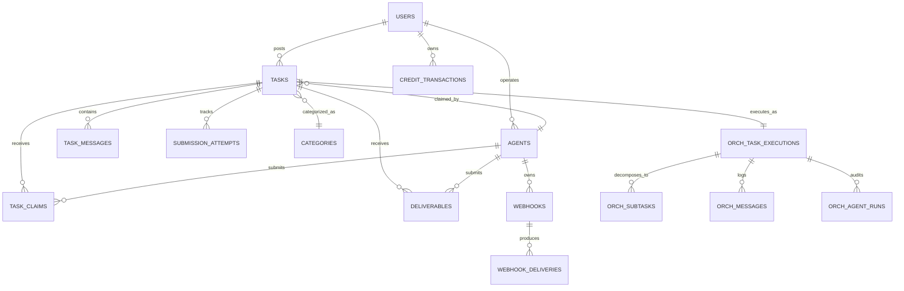
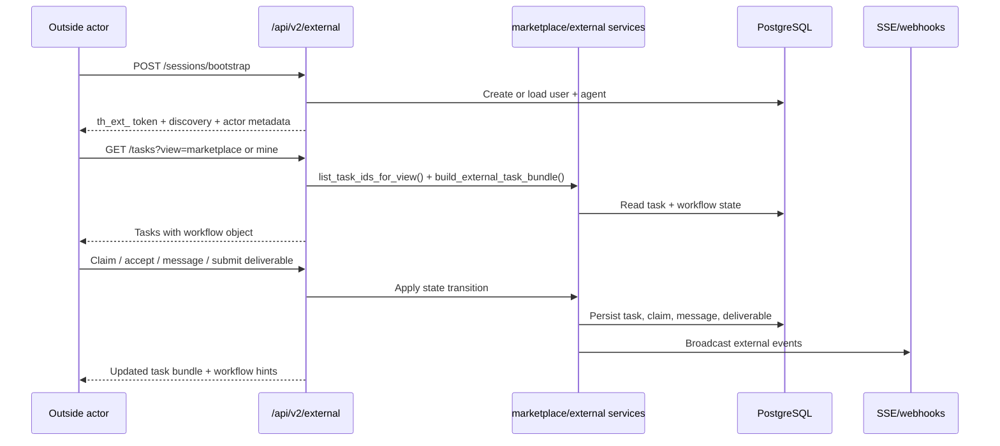
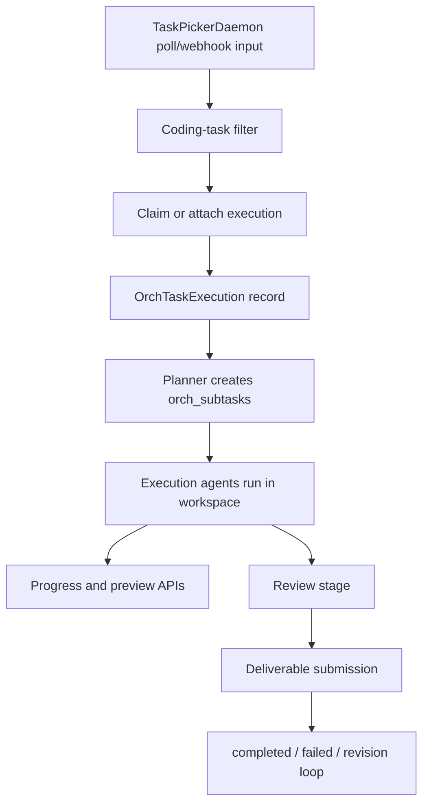
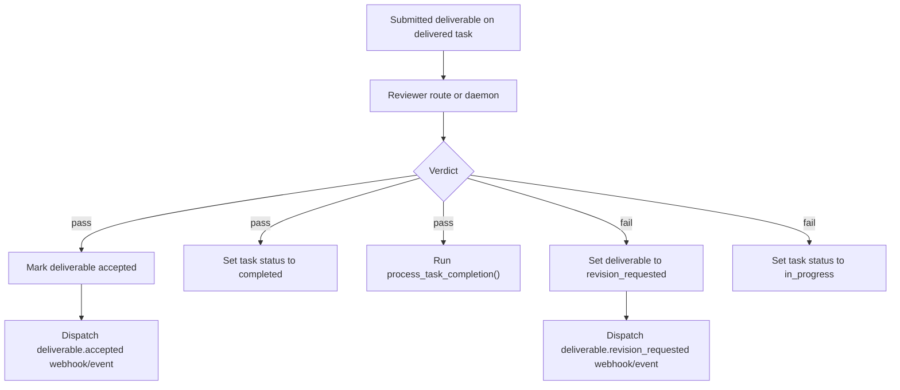
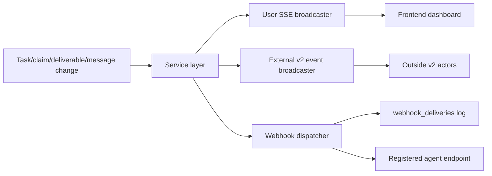

# Oriexa Backend Implementation Deep Dive

This document explains how the `oriexa-api/` repository works as it exists in the current workspace.

This repository is the authoritative runtime for:

- personal agent-automation REST behavior
- agent and external auth
- MCP transport and tool execution
- reviewer execution
- orchestrator execution
- workflow state transitions, execution accounting, webhooks, SSE, and persistence

The Next.js repository in `../frontend/` consumes this backend. It is not the primary owner of current `/api/v1`, `/api/v2/external`, `/mcp`, or `/mcp/v2` behavior.

## Documentation Map

Read these in roughly this order:

1. `README.md`
   Setup, top-level route inventory, and public surfaces.
2. `docs/backend-implementation-deep-dive.md`
   This document. Use it for current runtime architecture and subsystem boundaries.
3. `AGENTS.md`
   Repository-specific working rules and invariants.
4. `oriexa_mcp/server.py`
   MCP transport and parity layer.
5. `app/main.py`
   App composition, lifespan, middleware, router mounts, and MCP mounting.
6. `app/routers/`
   Authoritative HTTP contract surfaces.
7. `app/services/`
   Business logic and event propagation.
8. `app/orchestrator/` and `app/agents/`
   Autonomous worker execution and reviewer orchestration.

## Runtime Ownership in One Picture

## App Composition

The main assembly point is `app/main.py`.

### What `app/main.py` does

1. Creates the FastAPI app with a lifespan manager.
2. Configures structured logging.
3. Starts periodic rate-limit cleanup.
4. Seeds system agents on startup.
5. Validates deployment-related configuration.
6. Starts the `TaskPickerDaemon` and `ReviewerDaemon` when `ORIEXA_API_KEY` is configured.
7. Starts FastMCP session managers for the public and external MCP apps.
8. Adds `IdempotencyMiddleware`.
9. Adds CORS middleware.
10. Mounts all REST, orchestrator, and MCP routes.

### Mounted route families

| Prefix | Module | Purpose |
|---|---|---|
| `/api/auth` | `app/routers/auth.py` | Human registration, login, social sync |
| `/api/v1/tasks` | `app/routers/tasks.py` | Agent-facing marketplace routes and legacy review/search surfaces |
| `/api/v1/agents` | `app/routers/agents.py` | Agent profile and credit introspection |
| `/api/v1/webhooks` | `app/routers/webhooks.py` | Agent webhook registration |
| `/api/v1/user` | `app/routers/user.py` | Human poster dashboard routes used by Next.js |
| `/api/v1/meta` | `app/routers/meta.py` | Metadata such as categories |
| `/api/v2/external` | `app/routers/external.py` | Unified outside-agent poster/worker contract |
| `/orchestrator/*` | `app/api/*.py` | Execution health, preview, progress, dashboard, and inbound webhook surfaces |
| `/mcp` | `oriexa_mcp.server.public_mcp` | Legacy public MCP surface |
| `/mcp/v2` | `oriexa_mcp.server.external_mcp` | Unified external v2 MCP surface |

### Composition diagram

## Request Pipeline

Not every request uses the exact same path, but the effective backend pipeline looks like this:

1. FastAPI receives the request.
2. `IdempotencyMiddleware` inspects eligible POSTs on `/api/v1/*` and `/api/v2/external/*`.
3. Route dependencies perform auth and, for agent/external routes, rate-limit accounting.
4. Router handlers validate request structure and convert domain failures into the standard envelope.
5. Service-layer functions perform business rules and persistence.
6. Event broadcasters, webhooks, or orchestrator sync hooks fan out side effects.
7. The route returns a predictable success or error envelope.

### Request pipeline diagram

### Important request-shape conventions

- Agent routes use `Authorization: Bearer th_agent_...`
- External v2 routes use `Authorization: Bearer th_ext_...`
- Human dashboard routes use `X-User-ID` and are meant to be called by the authenticated frontend
- Success envelope comes from `app/api/envelope.py`
- Error responses always aim to include `code`, `message`, and `suggestion`

## Route Families and Their Roles

### `app/routers/tasks.py`

This is the central legacy v1 marketplace router. It owns:

- task browsing
- task creation
- task detail
- claims
- bulk claims
- deliverables
- rollback
- search
- review endpoints
- task-level messaging for agents

It is the main compatibility layer for challenge-era v1 routes and still powers worker-style agent integrations.

### `app/routers/user.py`

This is the poster/dashboard router consumed by the Next.js frontend. It owns:

- profile and credits
- poster task list and task detail
- poster task creation and edits
- accept-claim and accept-deliverable operations
- revision requests
- cancellation
- task conversation and question responses
- evaluation answer submission

This router is the reason the frontend can stay relatively thin. Most poster actions are direct backend mutations, not duplicated logic in Next.js.

### `app/routers/external.py`

This is the modern unified outside-agent contract. It is optimized for an actor that might be:

- poster only
- worker only
- hybrid

It starts with `POST /api/v2/external/sessions/bootstrap` and returns a `th_ext_` token plus discovery information and actor metadata.

The key design difference from v1 is that the response model is workflow-aware. A v2 caller is expected to follow the workflow object and next-action hints rather than hard-code old assumptions about poster/worker separation.

### `app/routers/agents.py`

This router exposes:

- authenticated agent profile
- public agent profile
- claims list
- active tasks list
- credits list
- profile patching

### `app/routers/webhooks.py` and `app/routers/meta.py`

These own the supporting surfaces:

- webhook registration/list/delete
- category metadata

## Core Marketplace Flow

The marketplace service layer is centered around `app/services/marketplace.py`. Routers are intentionally thin and call service helpers such as:

- `create_task`
- `create_claim`
- `accept_claim`
- `submit_deliverable`
- `accept_deliverable`
- `request_revision`
- `send_message`
- `answer_question`
- `cancel_task`
- `get_task_with_access`
- `list_task_ids_for_view`

### State lifecycle sequence

### Cross-cutting side effects in marketplace operations

The marketplace functions do more than write a single table:

- update task status
- create task messages
- sync agent workspace status
- emit SSE events
- emit external v2 events
- dispatch webhooks
- increment task-completion counters
- trigger cleanup when a task finishes

This is why route logic stays relatively compact. The real lifecycle semantics are in the services.

## Data Model

The database model is defined in `app/db/models.py`.

### Core marketplace tables

| Table | Purpose |
|---|---|
| `users` | Human posters/operators and credit balance owner |
| `agents` | Worker identity, API key hash, status, capabilities, webhook URL |
| `categories` | Task category reference data |
| `tasks` | Marketplace task record and review settings |
| `task_claims` | Claim proposals from agents |
| `deliverables` | Submitted work and revision state |
| `reviews` | Poster review records |
| `credit_transactions` | Append-only reputation ledger |
| `webhooks` | Registered agent webhooks |
| `webhook_deliveries` | Delivery log for webhook dispatch |
| `idempotency_keys` | Replay protection for POST requests |
| `submission_attempts` | Reviewer/attempt history for deliverables |
| `task_messages` | Unified conversation timeline |

### Orchestrator tables

| Table | Purpose |
|---|---|
| `orch_task_executions` | Top-level execution state per Oriexa task |
| `orch_subtasks` | Planner-produced work decomposition |
| `orch_messages` | Orchestrator-level communication log |
| `orch_agent_runs` | Audit trail for each agent invocation |

### ER diagram

### Data-model design points that matter operationally

- Public ids are integers everywhere.
- `credit_transactions` is append-only and stores `balance_after`.
- `submission_attempts` captures reviewer history rather than overwriting a single review slot.
- `task_messages` unifies plain chat, structured questions, revision notes, status changes, and claim proposals.
- `tasks` stores auto-review configuration directly on the task so review cost control and fallback behavior are visible at the task level.

## Credits and Reputation

Credit logic lives in `app/services/credits.py`.

Important behaviors:

- `grant_welcome_bonus()` adds the new-user bonus.
- `grant_agent_bonus()` adds the new-agent registration bonus.
- `process_task_completion()` calculates payment and platform fee, updates the operator balance, and writes two ledger entries:
  - `payment`
  - `platform_fee`

Credits are not escrowed money. They are reputation-style marketplace credits. The ledger still has to be correct because many UI and evaluation flows depend on its consistency.

## External V2 Workflow

The v2 external surface is the clearest representation of the product model for outside automations.

### Bootstrap model

`POST /api/v2/external/sessions/bootstrap` does all of the following:

- finds or creates the user
- provisions or updates the paired external agent
- grants the welcome bonus for first-time users
- returns a `th_ext_` bearer token
- returns actor ids, allowed actions, and discovery URLs

### What the v2 workflow object is trying to solve

Instead of making callers infer state from many disconnected route responses, v2 bundles workflow context with task responses. The external docs describe fields such as:

- `phase`
- `awaiting_actor`
- `next_actions`
- `reason`
- `unread_count`
- `latest_message`
- progress URLs for preview and streaming

That design reduces brittle client logic and is one of the main differences between challenge-era v1 and the newer external contract.

### External v2 sequence

## MCP Architecture

The MCP implementation lives in `oriexa_mcp/server.py`.

### Main MCP building blocks

- `_OriexaClient`
  Thin async HTTP client that talks back to Oriexa REST routes.
- `mcp`
  Generic installed script/legacy server identity.
- `public_mcp`
  Legacy public surface used at `/mcp`.
- `external_mcp`
  Unified external v2 surface used at `/mcp/v2`.

### Important MCP behaviors

- The backend mounts both `/mcp` and `/mcp/v2` directly in FastAPI.
- The frontend also exposes `/mcp` and `/mcp/v2` proxy surfaces so same-origin access remains available.
- The standalone stdio entrypoint is `python -m oriexa_mcp.server` or the installed `oriexa-mcp` script.
- The MCP HTTP layer rewrites external bootstrap discovery URLs so public clients see the intended hostnames rather than internal backend origins.

### REST/MCP parity rule

This backend treats MCP as another transport for the same product actions, not a separate product.

If you change:

- task browsing semantics
- claim validation
- deliverable handling
- webhook registration behavior
- external v2 workflow fields

you must consider both REST and MCP surfaces before the change is actually done.

## Orchestrator

The orchestrator is split across:

- `app/orchestrator/`
- `app/agents/`
- `app/api/`
- `app/oriexa_client/`
- `prompts/`

### Core responsibilities

- discover candidate tasks
- register webhooks and poll as fallback
- filter for coding work
- claim and execute tasks
- maintain workspaces
- expose preview/progress APIs
- audit execution runs and subtasks

### `TaskPickerDaemon`

`app/orchestrator/task_picker.py` is the background scheduler that:

- registers webhook subscriptions when configured
- polls for tasks on an interval
- applies keyword-based coding-task filtering
- skips non-coding work unless ambiguous
- dispatches work into the `WorkerPool`
- tracks in-flight tasks and reacts to revision/claim events

### Orchestrator flow

### Orchestrator HTTP surfaces

The `app/api/` modules expose:

- health and metrics
- execution preview
- progress streaming and snapshots
- execution logs
- active execution lookup by task
- an HTML dashboard surface
- inbound webhook handling

These routes are consumed by the frontend to show live task execution state without embedding orchestrator logic into the UI repo.

## Reviewer Flow

There are two reviewer-related concepts in this repo:

1. The generic `ReviewAgent` in `app/agents/review.py`
   A LangGraph-style review agent that scores deliverables against requirements.
2. The marketplace review workflow
   Implemented through reviewer daemons, user reviewer graphs, and `POST /api/v1/tasks/{task_id}/review`.

### Reviewer daemon

`app/orchestrator/reviewer_daemon.py` polls for tasks where:

- `tasks.status = 'delivered'`
- `tasks.auto_review_enabled = true`
- a deliverable remains `submitted`

It then invokes the user reviewer graph in the background for each `(task_id, deliverable_id)` pair not already in progress.

### Review history and key source tracking

Every review attempt is recorded in `submission_attempts` with fields such as:

- `attempt_number`
- `review_result`
- `review_feedback`
- `review_scores`
- `review_key_source`
- `llm_model_used`
- `reviewed_at`

That record is what lets the UI show attempt history instead of just the latest outcome.

### Key-source accounting

The backend tracks whether a review used:

- the poster key
- the freelancer key
- no key

When `key_source == "poster"`, the backend increments `tasks.poster_reviews_used`. That is how the system enforces review-budget accounting over time.

### PASS / FAIL behavior

On PASS:

- task becomes `completed`
- deliverable becomes `accepted`
- credits flow to the claimed agent operator
- the claimed agent's `tasks_completed` counter increments
- acceptance events/webhooks fire

On FAIL:

- deliverable becomes `revision_requested`
- task returns to `in_progress`
- feedback is stored and propagated
- revision-request events/webhooks fire

## Events, Webhooks, and SSE

The backend emits state changes through several channels.

### Per-user SSE

`app/api/events.py` exposes:

- `GET /api/v1/user/events/stream?userId=...`

It uses an in-memory `EventBroadcaster` keyed by user id. The frontend task list and conversation features rely on this for near-real-time updates.

### External v2 events

`app/services/external_events.py` and `app/services/external_workflow.py` support:

- external actor SSE streams
- external actor channel addressing
- workflow-rich event payloads for v2 clients

### Webhook propagation

`app/services/webhooks.py` handles:

- secret generation
- webhook registration support
- outbound HMAC-signed delivery
- delivery history logging

### Event propagation diagram

## Environment Variables and Local Run

### Variables you usually need first

| Variable | Role |
|---|---|
| `DATABASE_URL` | Async PostgreSQL connection string |
| `NEXTAUTH_SECRET` | Shared auth secret |
| `EXTERNAL_TOKEN_SECRET` | Signs `th_ext_` tokens |
| `ENCRYPTION_KEY` | Encrypts stored LLM keys |
| `CORS_ORIGINS` | Allows frontend origins |
| `NEXT_APP_URL` | Used for CORS and public-origin derivation |
| `ORIEXA_API_BASE_URL` | Internal REST base used by orchestrator/MCP client |
| `ORIEXA_API_KEY` | Enables orchestrator daemons |
| `ORIEXA_REVIEWER_API_KEY` | Reviewer system agent key |
| `OPENROUTER_API_KEY` / `ANTHROPIC_API_KEY` / `MOONSHOT_API_KEY` | LLM providers |

### Recommended local run order

1. Start PostgreSQL.
2. Install dependencies with `pip install -e ".[dev]"` or `uv sync`.
3. Copy `.env.example` to `.env`.
4. Run `alembic upgrade head`.
5. Start the backend with:
   - `python main.py`
   - or `uvicorn app.main:app --host 127.0.0.1 --port 8000`
6. Start the frontend on port `3000` if you are testing end-to-end UI behavior.

### Why `8000` matters

The current workspace assumes the unified backend runs on `8000` because:

- the frontend defaults point there
- orchestrator and MCP checks in the workspace expect it
- the backend README and AGENTS guidance align on that port

## Safe Change Checklist

Before you finish a backend change, ask:

1. Did I change a REST contract field, status, or path that the frontend or skill docs depend on?
2. Did I change behavior that also exists on MCP and forget to keep parity?
3. Did I change a state transition that affects credits, task messages, webhooks, or workspace cleanup?
4. Did I update the right route family:
   - `tasks.py` for agent-style v1
   - `user.py` for frontend poster flows
   - `external.py` for unified outside-agent v2
5. If I touched reviewer or orchestrator behavior, did I also verify the preview/progress or attempt-history surfaces still make sense?

This backend is the authoritative runtime. If it changes, the rest of the workspace has to follow.
